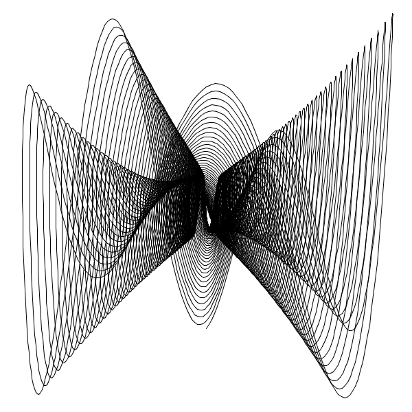
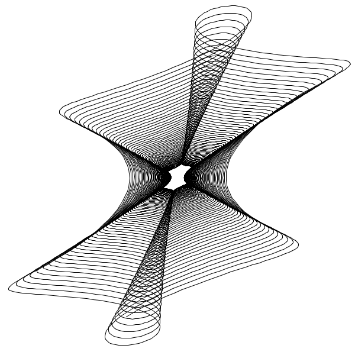
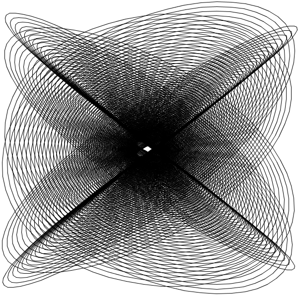
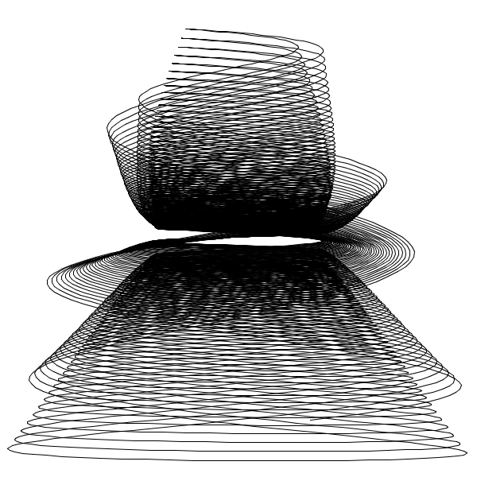
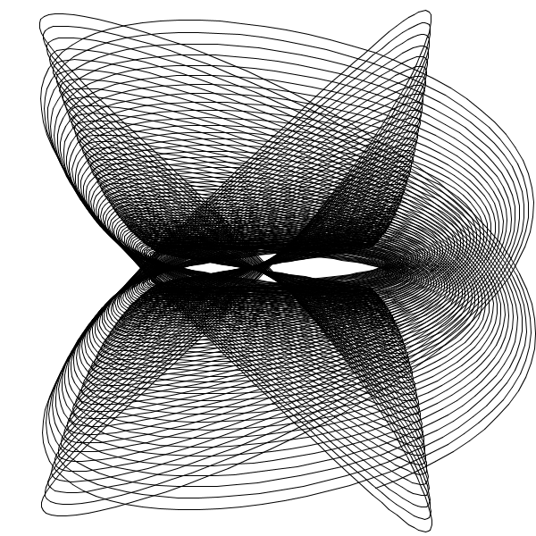

# harmonograph

Simulation of [harmonograph](https://en.wikipedia.org/wiki/Harmonograph)

To explore parameters, use the following keys:
  * `a` randomly changes amplitudes
  * `f` randomly changes frequencies
  * `p` randomly changes phases
  * `d` randomly changes damps
  * `space` randomly reinitializes all the parameters
  * `s` takes a screenshot in `curve.png`
  * `v` prints current parameter values

